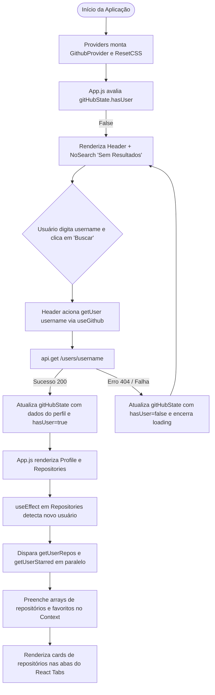

# 🔍 Git Search Engine — Buscador de Usuários e Repositórios do GitHub

<br />

<div align="center">

[](https://search-git-engine-6ixms1r9o-erickystn.vercel.app/)
[](https://react.dev/)
[](https://axios-http.com/)
[](https://styled-components.com/)
[](https://github.com/reactjs/react-tabs)
[](https://docs.github.com/pt/rest)
[](LICENSE)
[](#)

</div>

---

## 🔗 Demonstração ao Vivo (Deploy)

A aplicação está disponível e pronta para uso através do deploy na **Vercel**:

👉 **[Acesse o Git Search Engine Online](https://search-git-engine-6ixms1r9o-erickystn.vercel.app/)**

---

## 📖 Visão Geral

O **Git Search Engine** é uma Single Page Application (SPA) construída em **React 18** desenvolvida para consulta e exploração dinâmica de dados públicos de desenvolvedores na plataforma do **GitHub**.

A ferramenta permite pesquisar qualquer usuário cadastrado através do seu *username*, recuperando de forma assíncrona informações biográficas, avatar, métricas sociais (seguidores, seguindo, repositórios públicos e gists), além de listar todos os seus **Repositórios Próprios** e **Projetos Favoritados (Starred)** organizados em abas interativas acessíveis.

A aplicação adota o padrão de gerenciamento de estado global via **React Context API** com **Custom Hooks** dedicados, garantindo desacoplamento entre as camadas de serviço HTTP (baseadas em **Axios**) e os componentes visuais estilizados com **Styled-Components**.

---

## ✨ Funcionalidades

* **Barra de Pesquisa Inteligente:** Campo de entrada com botão de busca que aciona a consulta à API do GitHub apenas quando há texto preenchido, evitando requisições vazias.
* **Perfil do Desenvolvedor Detalhado:**
  * Foto de perfil circular em alta resolução (`avatar_url`).
  * Nome completo e nome de usuário (`login`) com link direto para o perfil oficial no GitHub.
  * Informações de contexto: Empresa (`company`), Localização (`location`) e Website/Blog pessoal (`blog`).
  * Contadores dinâmicos de métricas: Seguidores (*Followers*), Seguindo (*Following*), Gists Públicos (*Gists*) e Repositórios Públicos (*Repos*).
* **Navegação em Abas Acessíveis (React Tabs):**
  * Aba **Repositories:** Lista todos os repositórios de código aberto mantidos pelo usuário pesquisado.
  * Aba **Starred:** Lista todos os projetos marcados com estrela pelo desenvolvedor.
* **Cards de Repositório com Acesso Direto:** Cada card exibe o nome do projeto, o identificador completo (`full_name`) e um link externo configurado com `target="_blank"` e `rel="noreferrer"`.
* **Tratamento de Estado Vazio e Loading:**
  * Componente `NoSearch` exibido como tela de boas-vindas antes de qualquer busca ou quando nenhum usuário é localizado.
  * Indicador de carregamento (*Loading*) durante o processamento das Promises da rede.

---

## 🎯 Diferenciais e Destaques Técnicos

1. **Context API com Custom Hook (`useGithub`):** Centralização de todo o estado da busca (`gitHubState`) no `GithubProvider`, expondo métodos memoizados com `useCallback` (`getUser`, `getUserRepos`, `getUserStarred`) para garantir estabilidade referencial e prevenir re-renderizações desnecessárias.
2. **Cliente HTTP Desacoplado com Axios:** Configuração de instância dedicada em `src/services/api.js` com `baseURL: 'https://api.github.com/'`, padronizando interceptadores e facilitando chamadas assíncronas em cascata.
3. **Chamadas Assíncronas em Cadeia e Tratamento de Efeitos:** Ao carregar os dados cadastrais do usuário, o componente `Repositories` aciona via `useEffect` as consultas complementares para recuperar repositórios e projetos com estrela em paralelo.
4. **CSS-in-JS com Styled-Components e Reset Global:**
   * Estilização modular por componente (`styled.js`).
   * Reset de CSS profissional baseado no **destyle.css v3.0.2** injetado via `createGlobalStyle` (`src/global/resetCSS.js`), uniformizando estilos em múltiplos navegadores.
   * Integração de estilos nas abas do `react-tabs` através de classes de estado ativas (`.is-selected`).

---

## 🏗️ Arquitetura e Estrutura de Pastas

```bash
Git_Search_Engine/
├── package.json                               # Dependências (React, Axios, Styled-Components, React-Tabs)
├── package-lock.json                          # Versões exatas e resolução do npm
├── README.md                                  # Documentação técnica do projeto
├── build/                                     # Build estática otimizada de produção
├── public/
│   ├── favicon.ico                            # Ícone do aplicativo
│   ├── index.html                             # Template HTML mestre com elemento raiz #root
│   ├── manifest.json                          # Metadados de PWA
│   └── robots.txt                             # Diretivas de indexação para rastreadores
└── src/
    ├── App.js                                 # Componente orquestrador de layout e renderização condicional
    ├── index.js                               # Ponto de entrada do React 18 com ReactDOM.createRoot
    ├── providers.js                           # Contêiner de Provedores globais (ResetCSS e GithubProvider)
    ├── assets/img/
    │   └── logo.png                           # Logotipo ilustrado do GitHub com lupa de pesquisa
    ├── components/
    │   ├── header/                            # Barra de pesquisa e logotipo
    │   │   ├── index.js                       # Input e botão de submissão da busca
    │   │   └── styled.js                      # Estilização com Styled-Components
    │   ├── layout/                            # Contêiner envolvente do aplicativo
    │   │   ├── index.js
    │   │   └── styled.js
    │   ├── no-search/                         # Feedback visual para ausência de busca
    │   │   ├── index.js
    │   │   └── styled.js
    │   ├── profile/                           # Card com avatar e estatísticas do usuário
    │   │   ├── index.js
    │   │   └── styled.js
    │   ├── repositories/                      # Abas de Repositories e Starred (React Tabs)
    │   │   ├── index.js
    │   │   └── styled.js
    │   └── repository-item/                   # Card individual de exibição de repositório
    │       ├── index.js
    │       └── styled.js
    ├── global/
    │   └── resetCSS.js                        # Reset global de estilos via createGlobalStyle
    ├── hooks/
    │   └── github-hooks.js                    # Custom Hook useGithub para consumo do GithubContext
    ├── providers/
    │   └── github-provider.js                 # Provedor do Contexto com estado da busca e chamadas Axios
    └── services/
        └── api.js                             # Instância configurada do Axios para a API do GitHub
```

---

## 🔄 Fluxo de Busca e Ciclo de Vida da Aplicação



---

## 🌐 Consumo da API do GitHub e Auditoria de Segurança

A aplicação consome a **GitHub REST API v3**:

| Recurso | Método HTTP | Rota da API | Dados Obtidos |
| :--- | :---: | :--- | :--- |
| **Perfil de Usuário** | `GET` | `https://api.github.com/users/{username}` | Nome, avatar, bio, seguidores, gists e contagem de repositórios. |
| **Repositórios** | `GET` | `https://api.github.com/users/{username}/repos` | Lista de projetos públicos com nome, descrição e link web. |
| **Favoritos (Starred)** | `GET` | `https://api.github.com/users/{username}/starred` | Lista de repositórios marcados com estrela pelo usuário. |

### Tratamento de Erros e Limitações de Rede
* **Usuário Não Encontrado (HTTP 404):** A promessa do Axios é capturada em bloco `.catch()`, alterando `hasUser: false` para restaurar o estado limpo da tela com o componente `NoSearch`.
* **Rate Limiting da API Pública (HTTP 403):** A API pública sem autenticação possui limite de **60 requisições por hora por IP**. Caso esse teto seja atingido, a Promise cai no bloco de erro, evitando inconsistências no estado do React.

### Auditoria de Segurança e Boas Práticas

* **✅ Pontos Positivos:**
  * **Operações Read-Only:** Todas as chamadas à API são exclusivamente de leitura (`GET`), dispensando a necessidade de expor tokens ou credenciais privadas no frontend.
  * **Links Externos Seguros:** Links para páginas do GitHub utilizam explicitamente os atributos `target="_blank"` e `rel="noreferrer"`, prevenindo vulnerabilidades de *Tabnabbing*.
* **⚠️ Riscos Identificados e Plano de Mitigação:**
  * *Risco:* Uso do protocolo inseguro `http://api.github.com/` na configuração da baseURL do Axios.
    * *Mitigação Sugerida:* Atualizar a baseURL para `https://api.github.com/`, garantindo criptografia TLS em trânsito.
  * *Risco:* Esgotamento do limite de requisições por IP em redes compartilhadas.
    * *Mitigação Sugerida:* Permitir que o usuário insira um *Personal Access Token (PAT)* opcional para elevar o teto para 5.000 requisições por hora.

---

## 📖 Passo a Passo de Uso

1. **Acessar a Aplicação:** Abra o [Deploy oficial na Vercel](https://search-git-engine-6ixms1r9o-erickystn.vercel.app/) ou execute localmente.
2. **Buscar um Usuário:** No campo de texto superior, digite o nome de usuário exato de uma conta do GitHub (ex: `erickystn`, `torvalds`, `gaearon`) e clique no botão **Buscar**.
3. **Inspecionar o Perfil:** Visualize os dados cadastrais, foto em tamanho ampliado e os contadores de seguidores e repositórios.
4. **Navegar pelas Abas:**
   * Clique na aba **Repositories** para navegar pelos projetos criados pelo desenvolvedor.
   * Clique na aba **Starred** para conferir as bibliotecas e ferramentas favoritas salvas por ele.
5. **Acessar o Código:** Clique sobre qualquer card de projeto para ser redirecionado diretamente à página do repositório no GitHub.

---

## 🎓 Objetivo do Projeto

Projeto prático desenvolvido durante a formação de **React Developer** na [Digital Innovation One (DIO)](https://www.dio.me/), focado em:
* Integração de aplicações React com APIs REST públicas de grande porte.
* Gerenciamento de estado global com **React Context API** sem a complexidade de bibliotecas pesadas.
* Construção de layouts flexíveis com **Styled-Components** e abas com **React Tabs**.

---

## ⚙️ Requisitos e Instalação

### Pré-requisitos
* [Node.js](https://nodejs.org/) versão 18 LTS ou 20 LTS.
* Gerenciador de pacotes `npm` ou `yarn`.
* [Git](https://git-scm.com/) instalado no sistema operacional.

### Instalação

1. Clone o repositório em sua máquina:
```bash
git clone https://github.com/erickystn/Git_Search_Engine.git
```

2. Acesse a pasta do projeto:
```bash
cd Git_Search_Engine
```

3. Instale as dependências:
```bash
npm install
```

---

## 🚀 Como Executar

### 1. Servidor de Desenvolvimento
Inicia a aplicação localmente com recarregamento em tempo real:
```bash
npm start
```
Acesse no navegador: `http://localhost:3000`

### 2. Build de Produção
Gera os arquivos otimizados e minificados para distribuição na pasta `build/`:
```bash
npm run build
```

---

## 💻 Exemplos de Código

### 1. Configuração do Provedor de Contexto (`src/providers/github-provider.js`)
```javascript
export const GithubContext = createContext();

const GithubProvider = ({ children }) => {
  const [gitHubState, setGitHubState] = useState({
    loading: false,
    hasUser: false,
    user: {},
    repositories: [],
    starred: []
  });

  const getUser = (username) => {
    setGitHubState((prev) => ({ ...prev, loading: true }));

    api.get(`users/${username}`)
      .then(({ data }) => {
        setGitHubState((prev) => ({
          ...prev,
          loading: false,
          hasUser: true,
          user: data,
        }));
      })
      .catch(() => {
        setGitHubState((prev) => ({ ...prev, loading: false, hasUser: false }));
      });
  };

  return (
    <GithubContext.Provider value={{ gitHubState, getUser }}>
      {children}
    </GithubContext.Provider>
  );
};
```

---

### 2. Custom Hook de Consumo (`src/hooks/github-hooks.js`)
```javascript
import { useContext } from "react";
import { GithubContext } from "../providers/github-provider";

const useGithub = () => {
  const { gitHubState, getUser, getUserRepos, getUserStarred } = useContext(GithubContext);
  return { gitHubState, getUser, getUserRepos, getUserStarred };
};

export default useGithub;
```

---

## 🧪 Suíte de Testes

O projeto conta com o ambiente de testes do **Jest** e da **React Testing Library**:

```bash
npm test
```

---

## 🛠️ Tecnologias Utilizadas

| Tecnologia | Versão | Função na Aplicação |
| :--- | :--- | :--- |
| **[React](https://react.dev/)** | `18.2.0` | Biblioteca base para criação da interface reativa e componentes declarativos. |
| **[Axios](https://axios-http.com/)** | `0.27.2` | Cliente HTTP baseado em Promises para consumo dos endpoints do GitHub. |
| **[Styled-Components](https://styled-components.com/)** | `5.3.5` | Solução de CSS-in-JS para estilização modular, temas e reset global. |
| **[React Tabs](https://github.com/reactjs/react-tabs)** | `5.1.0` | Componente acessível para organização e alternância entre repositórios e estrelas. |
| **[Vercel](https://vercel.com/)** | — | Plataforma de nuvem para hospedagem e entrega contínua da aplicação. |
| **[GitHub REST API](https://docs.github.com/pt/rest)** | v3 | Provedor de dados de usuários e repositórios em tempo real. |

---

## 📈 Melhorias e Próximos Passos (Roadmap)

- [ ] **Protocolo HTTPS Estrito:** Corrigir a URL da instância do Axios de `http://` para `https://api.github.com/`.
- [ ] **Feedback de Erro Aprimorado:** Exibir mensagem amigável específica informando se o erro foi "Usuário não encontrado" ou "Limite de requisições excedido".
- [ ] **Paginação de Repositórios:** Adicionar paginação ou scroll infinito para usuários com mais de 30 repositórios.
- [ ] **Filtro e Ordenação:** Permitir filtrar repositórios por linguagem predominante e ordenar por número de estrelas ou data de atualização.
- [ ] **Modo Escuro (Dark Mode):** Implementar alternância de tema no Styled-Components aproveitando o `ThemeProvider`.

---

## 🤝 Como Contribuir

1. Faça um **Fork** do projeto.
2. Crie uma branch para sua modificação:
   ```bash
   git checkout -b feature/minha-melhoria
   ```
3. Realize seus commits seguindo boas práticas:
   ```bash
   git commit -m "feat: adiciona paginacao na listagem de repositorios"
   ```
4. Envie suas alterações para o seu fork:
   ```bash
   git push origin feature/minha-melhoria
   ```
5. Abra um **Pull Request** detalhando as alterações.

---

## 👤 Autor & Créditos

* **Desenvolvedor:** [Ericky Sant'ana](https://github.com/erickystn)
* **Formação e Mentoria:** Projeto construído no âmbito da formação em React na [Digital Innovation One (DIO)](https://www.dio.me/).

---

## 📄 Licença

Este projeto está disponível sob a licença **MIT**. Para maiores informações, consulte o arquivo de licença ou utilize o código livremente para propósitos educacionais e de portfólio.
